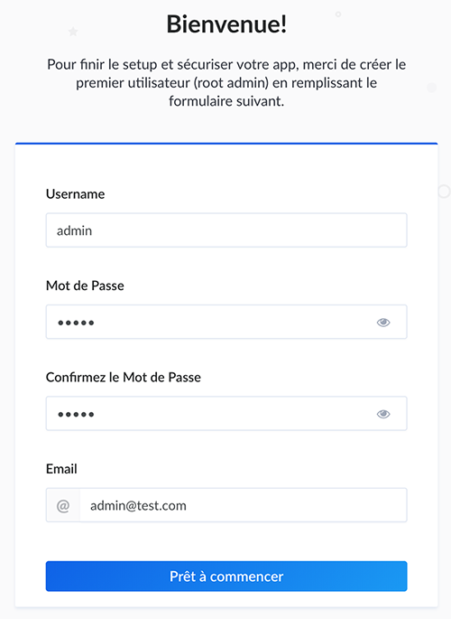
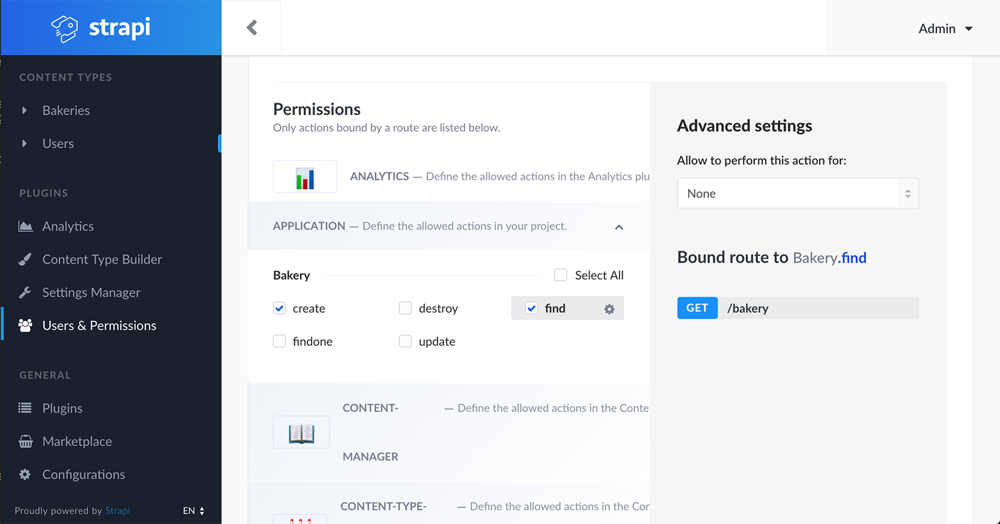
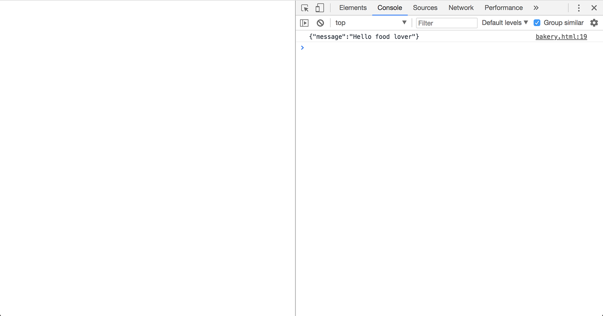
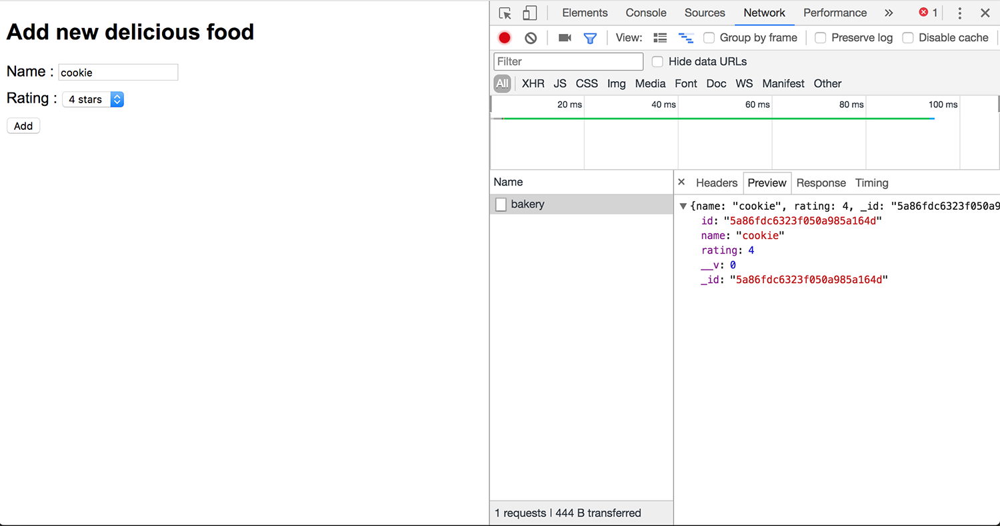

# Tutorial strapi + socket.io

> You need to have node > v8 , npm, mongo > 3.4 and basic understanding of JS/NodeJS

[Strapi](https://strapi.io/ "Strapi homepage") is a really promising CMF that make API managment so simple, it is based on [Koa](http://koajs.com/ "Koa homepage") and comes backed with and easy admin panel to create and manage your API.

We don’t need alot of work to set up our API anymore we can focus on others fun stuff, let's make thing goes real time with strapi & socket.io !

## Setup strapi

[Installation Code](tuto/0_install.md)

before starting strapi you can do `npm ls strapi` which print something like this :
```
strapi_socket@0.1.0 /path/to/project/strapi_socket
└── strapi@3.0.0-alpha.10.1
```

so you know where is the strapi used and we can see this is the local strapi inside our project’s node_modules and not the global version. We can now start strapi by running

```
strapi start
```

don't forget to start mongoDB (`mongo` on your terminal before starting strapi)

open [/admin](http://localhost:1337/admin) that will redirect you to [/admin/plugins/users-permissions/auth/register](http://localhost:1337/admin/plugins/users-permissions/auth/register) register your admin user. to login the admin panel.



## Add new model

in a few steps I will create a simple model named bakery from the content type builder tab


and give it two fields:
* field `name` is a string
* field `rating` is an integer


**IMPORTANT: don’t forget to click save !!!**

Strapi will create this [folder structure](tuto/1_model_structure.md) inside your project, those folders are self explanatory **config**, **controllers**, **models**, **services** ...
We can use them to do more, like add some logique inside the controller, that is exactly what we will do later.

## Modifying users permissions

Setup users permissions for guest role (not logged in) to read/create bakery entries, go back to admin panel on tab Users & Permissions tab. Click on Guest role, on *application* check **create** & **find** and don't forget to click save !



View data at [/bakery](http://localhost:1337/bakery) it should render an empty array `[]`

## Send socket event based from server to users

open `config/functions/bootstrap.js`  and create `public/bakery.html` [add this two code](tuto/2_connect_to_socket.md) then reload your page, to see the log inside developper console like this :



Now let's modify our html to create new bakery entries from our bakery.html file with [this code](tuto/3_create_data.md), after changing our code reload and set both name and rating value before submit with the add button.



You can check that the entry has been saved by checking [/bakery](http://localhost:1337/bakery) api url with GET method, it should respond with an non empty array this time.

```javascript
[{"_id":"5a86fdc6323f050a985a164d","name":"cookie","rating":4,"__v":0,"id":"5a86fdc6323f050a985a164d"}]
```

Yummy ! we stored our first bakery inside our mongoDB storage !

## Notify users on food creation

Again we are going to make some code change, inside `config/functions/bootstrap.js` [write this code](tuto/4_send_event_from_server_to_client.md), after that open our auto generated api controller for bakery entries `api/bakery/controllers/Bakery.js`, on ligne 47 there is the method that is called when a user create a bakery item

we will call our `emitToAllUsers()` function from strapi that we defined on `config/functions/bootstrap.js`, inside create method add [this line](tuto/5_sending_the_event_on_create.md).

at the end of our script tag inside `public/bakery.html` listen fo the food_ready event, add a `div#food` on your html plus [some JS](tuto/6_getting_the_user_notify.md), open two or more tab (i'm gonna use one chrome tab and one firefox tab) to test it, and play with both to see that both users get notified when someone save some sweet on our API.


That's all, with this quick intro on how to use strapi & socket.io we can image doing things like chat app, html5 online multiplayer games etc ...

